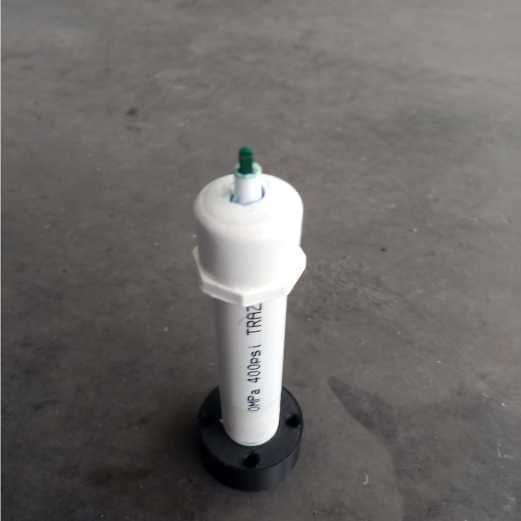
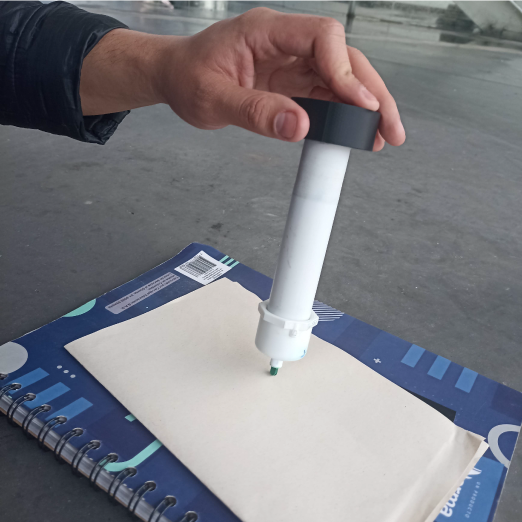
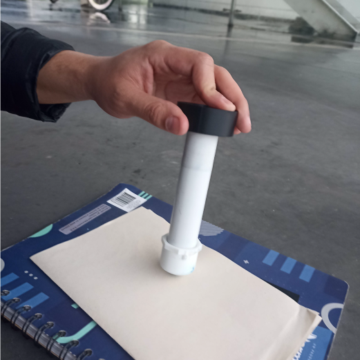

# Laboratorio 4 Robótica: Robótica Industrial
# Introducción
El objetivo de este laboratorio consistía en realizar las iniciales de los integrantes del equipo (J, L) en una superficie plana y replicar esta escritura en un plano inclinado 30° y además con una ubicación distinta. Además, se debía realizar control de este proceso, de tal manera que existirían dos señales que controlaran que proceso realizar, si las letras inclinadas, o en el plano normal. Para esto, se diseñó una herramienta (porta-marcador) que correspondiera al robot ABB IRB140 y que tuviera en cuenta algunos requerimientos de diseño. Posteriormente se desarrolló un módulo de RAPID en el software Robotstudio que permitió simular las trayectorias a realizar por el robot para la escritura y finalmente, después de comprobar por simulación un correcto procedimiento se llevó este módulo un robot IRB140 real.

## Diseño de la herramienta
Para diseñar el porta-marcador se tuvo en cuenta que la superficie en dónde se escribirían las letras no era totalmente plana, por el contrario, tenía un desnivel. Por esto, se hacía necesario en alguna parte de la herramienta implementar un resorte que permitiera un movimiento amortiguado del marcador para no dañarlo. Por sencillez, se optó por usar un tubo de PVC con dos tapas: una superior totalmente cerrada y una inferior con hueco para permitir el paso de la punta del marcador. Adicional a esto, se imprimió la pieza cilíndrica que permitía la únión de este tubo con el flange del robot.

A continuación, se muestran imágenes de la herramienta final utilizada:





Luego de tener la herramienta construida, se procedió a hacer la calibración con el robot de forma que se pudiera obtener el marco de referencia de la herramienta. Para ello, se tomaron 3 puntos donde el marcador terminaba en la misma ubicación pero con diferente orientación y un punto donde el marcador quedaba totalmente vertical. Después de obtener este marco, se exportó el módulo de RAPID que contenía la información de la herramienta y posteriormente se usó para definir todas las trayectorias.

## Código en RAPID
El archivo *ModuleJL.mod* es el módulo de RAPID usado para realizar la trayectoria del robot que permitía escribir las letras J y L. En la parte inicial del código se encuentra definida la herramienta m100 que fue calibrada anteriormente, los workobjects o sistemas de referencia `inclinado` y `prueba1`, inclinado es el workobject dónde se realizan las letras a 30 grados de la horizontal, mientras que prueba1 es el workobject de los robtarget de las trayectorias en el plano X-Y, y además, los robtargets que se usarían para construir las trayectorias de las letras (Home, J_1, J_2, ... , J_7, L_0, L_1, ... ,L_4).

Luego, se crearon dos señales en Robot Studio de tipo Digital Input, con el nombre DI_01 y DI_02, ya que así es como están creadas en el controlador físico del robot IRB 140.

Posteriormente, dentro del main se crea un IF, que tiene como condición (DI_01=1), que en casi de que esta se cumpla, se ejecuta la función J_inc y L_inc, las cuales corresponden a las trayectorias que dibujan la J y la L inclinadas, y luego se codfició otro IF, que verifica si (DI_02=1), y si está condición se cumple, se ejecuta la trayectoria plana (las funciones J y L). De la siguiente manera:

``` matlab
IF DI_01=1 THEN  
  J_inc;
  L_inc;
ENDIF
IF DI_02=1 THEN  
  J;
  L;
ENDIF
```

El proceso llamado J contiene inicialmente una instrucción `MoveJ` hacia Home, luego una instrucción de este mismo tipo hacia el punto J_1, el cual es una de las esquinas de la letra J. A continuación se usan tanto instrucciones `MoveL` y `MoveC` para realizar esta letra y cuando termina, se traslada a un punto que está unos centímetros por encima del punto final, de esta forma, se podrá mover la herramienta al punto donde inicia la letra L. 

El proceso L, es similar al anterior, en este caso sólo se usan instrucciones `MoveL` debido a que no se necesitan curvas. Se repite el proceso de llevar la herramienta a un punto superior del punto final antes de llevarlo a Home, esto con la finalidad de no tener una pequeña marca antes de que se regrese a Home.

Los puntos mencionados al inicio de esta sección fueron elaborados respecto al marco de referencia `prueba1`, a excepción del Home. De esta forma, para realizar la escritura de letras en el plano inclinado, simplemente se trasladó el origen del marco de referencia y se rotó según lo requerido para después repetir la ejecución del código.

## Simulación en Robotstudio e implementación con robot real

- Vídeo implementación de las señales y las trayectores en el robot IRB 140 del LabSir de la Universidad Nacional de Colombia: [https://youtube.com/shorts/0pYmCRa-8GM?feature=share](https://www.youtube.com/watch?v=Iu0UdvE64vo)

# Conclusiones
- Las señales son importantes para el control de procesos, es importante identificar el cableado de las mismas.
- Es importante hacer un uso útil de los workobjects en Robotstudio. En el caso de este laboratorio, al tener trayectorias elaboradas en un workobject distinto al del robot, fue sencillo hacer cambios en este al tener un plano superior al que inicialmente habíamos supuesto.
- Se debe tener en cuenta en la programación en RAPID en qué módulos están contenidos los workobjects, puntos o información adicional necesaria para relizar las trayectorias. Es posible comenter errores y crear estos objetos en módulos separados y al momento de importar el módulo que contiene el código principal, no se encontrará los objetos que están en otros módulos.
- A la hora de querer implementar una aplicación que involucre una celda robótica es imprescindible realizar las simulaciones para garantizar el buen funcionamiento de la celda. También es útil ejecutar el código línea por línea al momento de usar el robot real para evitar accidentes.
- En el diseño de la herramienta, se debe tener en cuenta la geometría del espacio, de forma que se puedan evitar daños a la misma.
